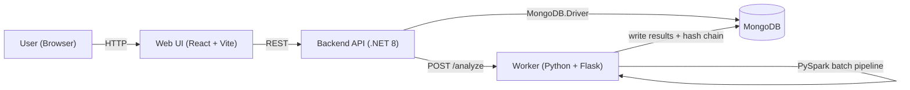

# SentimentGuard - Architecture

## High-Level Overview



## Layered Backend (.NET 8)

- Api
  - HTTP controllers (thin)
  - DI wiring (`Program.cs`)
  - `HeaderUserContext` (demo user scoping)
- Application
  - use cases as services (`UploadService`, `JobService`)
  - DTO mapping for API responses
  - service interfaces (`IUploadService`, `IJobService`, `IUserContext`)
- Domain
  - entities: `AnalysisJob`, `AnalysisResult`
  - enums: `JobStatus`, `SentimentLabel`, `CategoryLabel`
  - interfaces: repositories + integrity/report contracts
- Infrastructure
  - MongoDB repositories
  - worker trigger HTTP client
  - `HashChainService` and `PdfReportService`

## Worker Pipeline

1. Backend triggers: `POST /analyze { job_id, file_path }`
2. Worker reads the uploaded file (CSV/JSON).
3. PySpark parallelizes records (local mode) and processes rows:
   - extract comment
   - pseudo-anonymize identity fields with HMAC-SHA256
   - classify sentiment (Positive/Negative/Neutral)
   - assign MVP category (Complaint/Praise/Question/Disappointment/Other)
4. Worker persists:
   - job status/progress to `analysis_jobs`
   - results to `analysis_results` including `prevHash/currentHash`

## MongoDB Collections

- `analysis_jobs`
  - one document per upload/job
  - contains file name, status, progress, timestamps, and `userId`
- `analysis_results`
  - one document per analyzed record (row)
  - contains masked identity, comment, labels, and hash-chain fields

## Integrity (Hash Chain)

For each result record:

```
prevHash = "GENESIS" for the first record, otherwise previous record's currentHash
currentHash = SHA256(canonical_payload + "|" + prevHash)
```

Any modification to stored results breaks the chain from that record onward.

